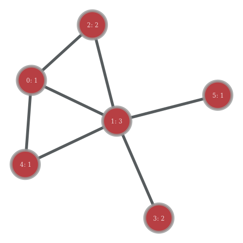
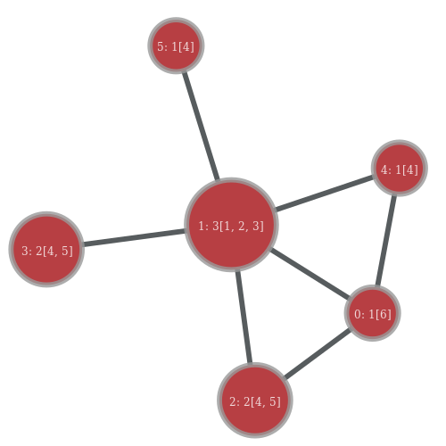
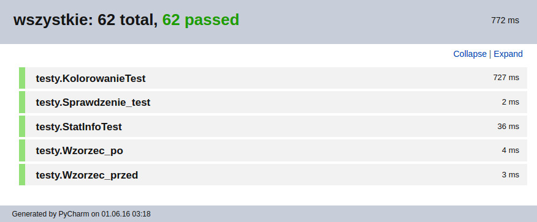
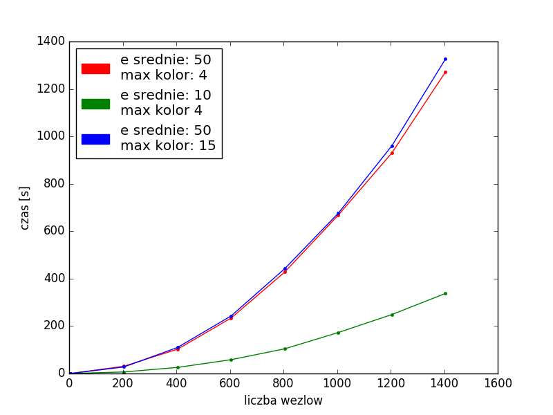

# Multikolorowanie wierzchołków grafu

## Opis
Dany jest spójny graf nieskierowany. 
Każdemu wierzchołkowi grafu należy przydzielić określoną liczbę „kolejnych” 
kolorów w taki sposób, aby wierzchołki sąsiednie (połączone krawędzią) nie miały 
żadnego koloru wspólnego. Liczba kolorów przydzielanych poszczególnym wierzchołkom 
stanowi dane wejściowe. Należy opracować algorytm i program wykorzystujący jak 
najmniejszą liczbę barw do takiego multikolorowania wierzchołków.

## Użyte technologie
+ **Graph-tool** (https://graph-tool.skewed.de/)  
Wysokowydajny moduł Pythona do manipulacji i analizy grafów. 
W przeciwieństwie do większości innych modułów Pythona o podobnej funkcjonalności, 
struktury danych i algorytmy są zaimplementowane w C++. 
Dzięki wykorzystaniu szablonów metaprogramowania w dużej mierze opartych o bibliotekę 
Boost Graph Library, osiągamy wykorzystanie pamięci i czas obliczeń porównywalny 
do czystego C.
+ **Python2.7**
+ **NumPy**
+ **Matplotlib**

## Wejście
Program wczytuje dane o grafie i liczbie kolorów przydzielanych 
poszczególnym wierzchołkom z pliku tekstowego w formacie XML lub bardziej 
przyjaznego do ręcznej edycji - DOT. Dla przykładowego grafu:

gdzie w każdym węźle jest numer wierzchołka i (po “:”) 
przydzielona liczba kolorów, plik XML wygląda następująco:

    <?xml version="1.0" encoding="UTF-8"?>
    <graphml xmlns="http://graphml.graphdrawing.org/xmlns"
         xmlns:xsi="http://www.w3.org/2001/XMLSchema-instance"
         xsi:schemaLocation="http://graphml.graphdrawing.org/xmlns http://graphml.graphdrawing.org/xmlns/1.0/graphml.xsd">
         
    <!-- property keys -->    
    <key id="key0" for="node" attr.name="liczba_kolorow" attr.type="int" />
    
    <graph id="G" edgedefault="undirected" parse.nodeids="canonical" parse.edgeids="canonical" parse.order="nodesfirst">

        <!-- vertices -->
        <node id="n0">
            <data key="key0">1</data>
        </node>
        <node id="n1">
            <data key="key0">3</data>
        </node>
        <node id="n2">
            <data key="key0">2</data>
        </node>
        <node id="n3">
            <data key="key0">2</data>
        </node>
        <node id="n4">
            <data key="key0">1</data>
        </node>
        <node id="n5">
            <data key="key0">1</data>
        </node>

        <!-- edges -->
        <edge id="e0" source="n0" target="n1"></edge>
        <edge id="e1" source="n1" target="n2"></edge>
        <edge id="e2" source="n1" target="n3"></edge>
        <edge id="e3" source="n1" target="n5"></edge>
        <edge id="e4" source="n2" target="n0"></edge>
        <edge id="e5" source="n4" target="n0"></edge>
        <edge id="e6" source="n4" target="n1"></edge>

    </graph>
    </graphml>
plik tego samego grafu w formacie DOT:

    graph G {
        0 [liczba_kolorow="1"];
        1 [liczba_kolorow="3"];
        2 [liczba_kolorow="2"];
        3 [liczba_kolorow="2"];
        4 [liczba_kolorow="1"];
        5 [liczba_kolorow="1"];
        0--1 ;
        1--2 ;
        1--3 ;
        1--5 ;
        2--0 ;
        4--0 ;
        4--1 ;
    }
    
## Wyjście
Program na wyjściu wygeneruje plik tekstowy w formacie XML o strukturze pliku wejściowego 
wzbogaconej o informacje dotyczące przydzielonych kolorów węzłom. Kolory reprezentujemy 
poprzez cyfry.  
Przykładowy plik XML wynikowego grafu:

    <?xml version="1.0" encoding="UTF-8"?>
    <graphml xmlns="http://graphml.graphdrawing.org/xmlns"
         xmlns:xsi="http://www.w3.org/2001/XMLSchema-instance"
         xsi:schemaLocation="http://graphml.graphdrawing.org/xmlns http://graphml.graphdrawing.org/xmlns/1.0/graphml.xsd">

    <!-- property keys -->
    <key id="key0" for="node" attr.name="liczba_kolorow" attr.type="int" />
    <key id="key1" for="node" attr.name="przypisane_kolory" attr.type="vector_int" />

    <graph id="G" edgedefault="undirected" parse.nodeids="canonical" parse.edgeids="canonical" parse.order="nodesfirst">

        <!-- vertices -->
        <node id="n0">
            <data key="key0">1</data>
            <data key="key1">6</data>
        </node>
        <node id="n1">
            <data key="key0">3</data>
            <data key="key1">1, 2, 3</data>
        </node>
        <node id="n2">
            <data key="key0">2</data>
            <data key="key1">4, 5</data>
        </node>
        <node id="n3">
            <data key="key0">2</data>
            <data key="key1">4, 5</data>
        </node>
        <node id="n4">
              <data key="key0">1</data>
            <data key="key1">4</data>
        </node>
        <node id="n5">
            <data key="key0">1</data>
            <data key="key1">4</data>
        </node>

        <!-- edges -->
        <edge id="e0" source="n0" target="n1"></edge>
        <edge id="e1" source="n1" target="n2"></edge>
        <edge id="e2" source="n1" target="n3"></edge>
        <edge id="e3" source="n1" target="n5"></edge>
        <edge id="e4" source="n2" target="n0"></edge>
        <edge id="e5" source="n4" target="n0"></edge>
        <edge id="e6" source="n4" target="n1"></edge>

    </graph>
    </graphml>

plik wynikowy w formacie dot:

    graph G {
        0 [liczba_kolorow="1", przypisane_kolory="6"];
        1 [liczba_kolorow="3", przypisane_kolory="1, 2, 3"];
        2 [liczba_kolorow="2", przypisane_kolory="4, 5"];
        3 [liczba_kolorow="2", przypisane_kolory="4, 5"];
        4 [liczba_kolorow="1", przypisane_kolory="4"];
        5 [liczba_kolorow="1", przypisane_kolory="4"];
        0--1 ;
        1--2 ;
        1--3 ;
        1--5 ;
        2--0 ;
        4--0 ;
        4--1 ;
    }

Ilustracja wynikowego grafu, gdzie w każdym węźle znajduje się id węzła, (po “:”) przydzielona liczba kolorów 
i (w nawiasach “[ ]”) lista kolorów przypisanych wierzchołkowi :

## Generacja i wizualizacja danych

Do generacji oraz wizualizacji danych wejściowych i wynikowych został napisany skrypt Pythona gis_tool.py możliwy 
do uruchomienia w 3 trybach:

    usage: gis_tool.py [-h] {generuj,rysuj_we,rysuj_wy} ...

    positional arguments:
    {generuj,rysuj_we,rysuj_wy}
                        tryby pracy, [tryb] --help for more info
    generuj             generuje graf wejsciowy
    rysuj_we            rysuje graf wejsciowy
    rysuj_wy            rysuje graf wynikowy

    optional arguments:
    -h, --help            show this help message and exit
    
#### Wizualizacja grafu wejściowego
Graf wejściowy można wizualizować poprzez druk do pliku png lub przeglądać w trybie interaktywnym:

    usage: gis_tool.py rysuj_we [-h] [-bn] [-I] [-PNG w h] Input

    positional arguments:
      Input               nazwa pliku wejsciowego do kolorowania (type: str)

    optional arguments:
    -h, --help          show this help message and exit
    -bn, --bez_napisow  nie rysuje teksu wewnatrz wezla
    -I, --interactive   wlacza interaktywny tryb przegladania grafu
    -PNG w h            drukuje plik png o nazwie argumentu pozycyjnego
    
#### Wizualizacja grafu wynikowego
Analogicznie jak dla grafu wejściowego:

    usage: gis_tool.py rysuj_wy [-h] [-I] [-PNG w h] Input

    positional arguments:
    Input              nazwa pliku wynikowego pokolorowanego (type: str)

    optional arguments:
    -h, --help         show this help message and exit
    -I, --interactive  wlacza interaktywny tryb przegladania grafu
    -PNG w h           drukuje plik png o nazwie argumentu pozycyjnego
    
#### Generowanie danych wejściowych:
Korzystając z ww. skryptu mamy możliwość generowania danych wejściowych (oraz od razy wizualizacji) :

    usage: gis_tool.py generuj [-h] [-N n] [-E e] [-C c] [-I] [-PNG w h] Output_file

    positional arguments:
    Output_file        nazwa pliku wynikowego, (type: str)

    optional arguments:
    -h, --help         show this help message and exit
    -N n               liczba wezlow (default: 10, type: int)
    -E e, --edges e    ~srednia liczba wylosowanych krawedzi dla wezla (default: 4, type: int)
    -C c, --colors c   max liczba wylosowanych kolorow dla wezla (default: 3, type: int)
    -I, --interactive  wlacza interaktywny tryb przegladania grafu
    -PNG w h           drukuje plik png o nazwie argumentu pozycyjnego

#### Kolorowanie:
Do pokolorowania grafu został stworzony skrypt kolorowanie.py. Interfejs skryptu:

    usage: kolorowanie.py [-h] [-o OUTPUT] [-c] [-s] [--INFO] Input_file

    positional arguments:
    Input_file

    optional arguments:
    -h, --help             show this help message and exit
    -o OUTPUT, --output OUTPUT
                             nazwa pliku wynikowego, (type: str)
    -c, --check          wykonuje sprawdzenie poprawnosci pokolorowania grafu
    -s, --stat              podaje dane statystyczne grafu
    --INFO                wyswietla dodatkowe informacje w trakcie wykonywania zadania (stan % wykonania zadania)
    
Skrypt *kolorowanie.py* generuje nowy plik z pokolorowanym grafem. (-o output_file)
Tym samym skryptem możemy wyświetlić dla już wygenerowanego pliku (zarówno przed 
kolorowaniem jak i po kolorowaniu) statystyki (flaga -s). Pozwala również sprawdzić 
poprawność pokolorowania (flagi -c).  
Przykładowe statystyki dla pokolorowanego grafu:

    {
        "max_kolor": 24, 
        "srednia_liczba_kolorow": 2.4911032028469751, 
        "sredni_wspolczynnik_klasteryzacji": 0.00822571783111871, 
        "liczba_wierzcholkow": 1405, 
        "sredni_stopien_wierzcholka": 9.5843416370106755, 
        "srednia_dlugosc_sciezki": 3.4592672331910692, 
        "liczba_krawedzi": 6733
    }
    
## Sprawdzenie poprawności pokolorowania grafu:
Dla każdego węzła jest sprawdzane:
+ czy węzeł został pokolorowany liczbą kolorów jaka była określona w danych wejściowych do programu.
+ czy nie ma żadnych kolorów wspólnych z sąsiadami
+ czy kolory w węźle są “kolejne”

W razie wystąpienia błędu skrypt rzuca wyjątkiem z dokładnym opisem w jakim węźle i jakiego rodzaju błąd wystąpił.

## Algorytm
Ze względu na bardzo szerokie zastosowania, kolorowanie grafów jest przedmiotem rozległych badań. 
Problemem znalezienia optymalnego pokolorowania, a także znalezienia liczby chromatycznej jest NP-trudny. 
Z tego względu do kolorowania dużych grafów nadają się jedynie algorytmy przybliżone.

Zaproponowany algorytm multikolorowania grafu został zaprojektowany wzorując się na algorytmie 
(mono)kolorowania SLF (saturated largest first).  
Kolejne kroki zaimplementowanego algorytmu:

    Stwórz listę węzłów z grafu.
    Sortuj listę węzłów po liczbie kolorów jakimi musimy je pokolorować.
    Sortuj listę węzłów po ich stopniu.
    Dopóki lista węzłów nie jest pusta:
    {
        Sortuj listę węzłów po sumie aktualnie przypisanych kolorów sąsiadów.
        Pokoloruj pierwszy z listy węzeł starając się wybrać jak najmniejsze dozwolone aktualnie kolory.
        Usuń z listy węzłów pokolorowany wierzchołek
    }

## Testowanie
Kod programu został dokładnie przetestowany pod kątem zarówno detekcji błędów, poprawności algorytmu i innych możliwych zachowań.
Pokrycie kodu 100%. Łącznie 62 testy. Wyniki zostały wyeksportowane do pliku 
*doc/Test Results - wszystkie.html*
Użyte dane testowe znajdują się w folderze *dane_testowe*.  
Aby uruchomić testy:

    python -m unittest discover -v

## Pomiar czasu wykonania
Za pomocą skryptu *profiler.py* zostały wygenerowane i pokolorowane grafy wraz z zestawieniem statystycznym 
w folderze profile_data.  
Dla każdego kolorowania został zmierzony czas i zawarty został w zestawieniu statystycznym. 
Każdy plik w nazwie posiada parametry grafu z jakimi został wygenerowany przez skrypt *gis_tool.py generuj*.

Wyniki profilowania dla wybranych zestawów parametrów:

Widać że zwiększenie liczby kolorów w węzłach do pokolorowania nie wpływa znacząco na czas działania algorytmu 
nawet dla dużej liczby wierzchołków. Zgodnie z przewidywaniami zwiększenie liczby krawędzi dla wierzchołków znacznie 
wpływa na czas działa algorytmu.

    Dla e_średnie = 50, max_kolor =4, n=1405:
	    czas wykonania: 1271 sekund
	    największy użyty kolor: 66
	    liczba krawędzi w grafie: 34582
    Dla e_średnie = 10, max_kolor =4, n=1405:
	    czas wykonania: 337 sekundy
	    największy użyty kolor: 24
	    liczba krawędzi w grafie: 6767
    Dla e_średnie = 50, max_kolor =15, n=1405:
	    czas wykonania: 1325 sekundy
	    największy użyty kolor: 234
	    liczba krawędzi w grafie: 34734